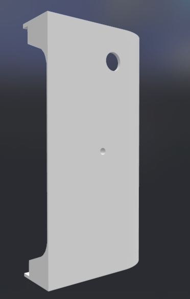
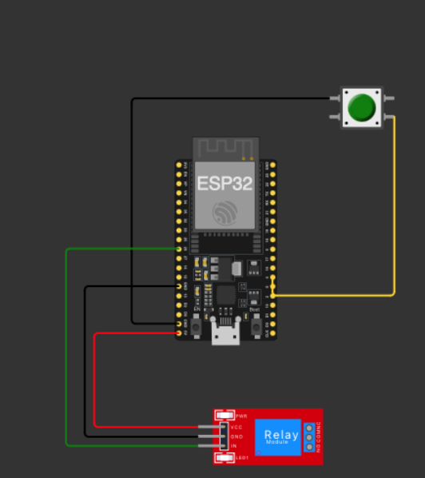
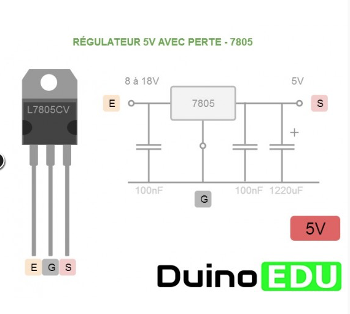
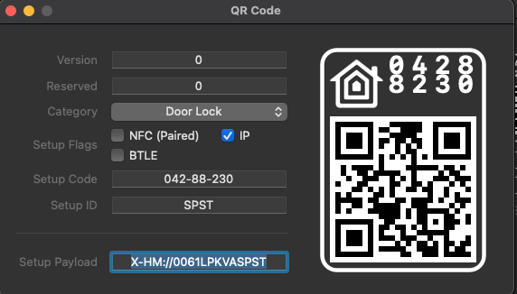

# SecureLock
Create an ESP32 Solenoid Fail Safe Lock for HomeKit

# Build

Install VSCode and PlateformIO, build as usual.

# Parts 

* ESP32 Devkit C v4 (or other, then change the board in plateformIO)

* Fail Safe Solenoid Lock : 
[From Amazon](<https://www.amazon.fr/gp/product/B07DW17J3Q/ref=ppx_yo_dt_b_asin_title_o04_s00?ie=UTF8&psc=1>)

* 12V power supply (any) and a soldered connector compatible with the supply socket

* LM7805 voltage regulator

* 2 Capacitors 100uf

* Momentary switch

* 3D Cover with push button in the "stl" folder

# Shematics

* Build a basic 5V power supply for the relay & the ESP32

Beware : connect only the 5v pin of the ESP32 ! and the GND, if your board does not have a 5V input pin, consider to buy another one with it.

# Homekit configuration

* Use build and monitor from PlateformIO menu, then use the W command in the monitor to setup you wifi credential.

* Then, use this barecode to add the accessory into you homekit

